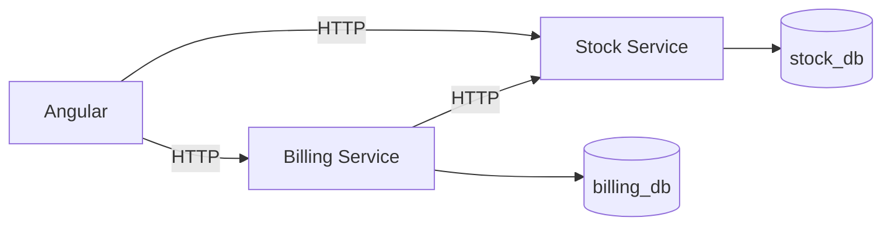

# Korp - Teste Técnico

Sistema de emissão de notas fiscais desenvolvido como parte do processo seletivo da Korp.

## Tecnologias

### Frontend
- Angular
- TypeScript
- RxJS
- SCSS

### Backend
- C#
- .NET 8
- ASP.NET Core Web API
- Entity Framework Core
- LINQ

### Banco de dados
- PostgreSQL

### Infraestrutura
- Docker
- Docker Compose

---

## Arquitetura

A solução foi estruturada utilizando dois microsserviços independentes:

- **Stock Service**: responsável pelo cadastro de produtos e controle de estoque.
- **Billing Service**: responsável pelo cadastro, consulta e fechamento de notas fiscais.

Cada serviço possui seu próprio banco de dados, mantendo separação de responsabilidades e independência entre os domínios.

O Billing Service se comunica com o Stock Service via HTTP para:

- validar a existência dos produtos;
- realizar a baixa de estoque no fechamento da nota.

O Billing Service não acessa diretamente o banco de dados do Stock Service.

### Diagrama



---

## Funcionalidades

### Produtos

- Cadastro de produtos;
- Consulta de produtos;
- Controle de saldo;
- Validação de código duplicado;
- Persistência em banco de dados PostgreSQL.

### Notas fiscais

- Cadastro de notas fiscais;
- Inclusão de múltiplos produtos;
- Quantidade individual por item;
- Numeração sequencial;
- Status inicial `Open`;
- Status final `Closed`;
- Consulta de notas;
- Consulta individual de nota;
- Fechamento e impressão;
- Atualização automática do estoque.

---

## Fluxo de fechamento da nota

O fechamento de uma nota ocorre da seguinte forma:

1. O usuário solicita a impressão de uma nota com status `Open`;
2. O Billing Service consulta os dados da nota e seus itens;
3. O Billing Service envia uma solicitação de baixa ao Stock Service;
4. O Stock Service valida os produtos e os respectivos saldos;
5. Caso todas as validações sejam aprovadas, os saldos são atualizados;
6. O Billing Service altera o status da nota de `Open` para `Closed`;
7. O frontend atualiza a interface e apresenta a impressão da nota.

Uma nota com status diferente de `Open` não pode ser fechada novamente.

---

## Tratamento de falhas

Foi implementado tratamento para indisponibilidade entre os microsserviços.

Caso o Stock Service esteja indisponível durante o fechamento de uma nota:

- o Billing Service retorna uma resposta controlada;
- o usuário recebe feedback sobre a indisponibilidade;
- a nota permanece com status `Open`;
- a operação pode ser repetida quando o serviço voltar a ficar disponível.

Também são tratados cenários como:

- produto inexistente;
- saldo insuficiente;
- tentativa de fechamento de nota já fechada;
- produto duplicado em uma mesma nota.

---

## Idempotência

A baixa de estoque foi implementada de forma idempotente.

Cada fechamento utiliza o identificador da nota como `OperationId`.

O Stock Service registra as operações processadas na tabela `StockOperations`.

Caso uma mesma operação seja enviada novamente, o serviço identifica que ela já foi processada e não realiza uma nova baixa no estoque.

Isso evita efeitos colaterais em cenários onde uma operação precise ser repetida após alguma falha de comunicação.

---

## Concorrência

A atualização de estoque é executada dentro de uma transação de banco de dados utilizando nível de isolamento `Serializable`.

O objetivo é proteger o saldo contra cenários concorrentes, como duas notas tentando consumir simultaneamente a última unidade disponível de um produto.

---

## Persistência

Foram utilizados dois bancos PostgreSQL independentes:

- `stock_db`
- `billing_db`

O Stock Service acessa exclusivamente o `stock_db`.

O Billing Service acessa exclusivamente o `billing_db`.

A comunicação entre os domínios ocorre por meio das APIs HTTP.

---

## Angular

O frontend foi desenvolvido utilizando Angular.

### Ciclos de vida

Foi utilizado o lifecycle hook:

- `ngOnInit`

Ele é utilizado para realizar o carregamento inicial dos dados das telas, como produtos e notas fiscais.

### RxJS

As chamadas HTTP utilizam `Observable`, através do `HttpClient` do Angular.

Também foi utilizado o operador:

- `finalize`

Ele garante que estados de carregamento e processamento sejam finalizados independentemente de sucesso ou erro na requisição.

Exemplo de uso:

```typescript
this.invoiceService.close(this.invoice.id)
  .pipe(
    finalize(() => {
      this.processing = false;
    })
  )
  .subscribe({
    next: invoice => {
      this.invoice = invoice;
    },
    error: error => {
      this.errorMessage =
        error.error?.message ??
        'Não foi possível imprimir a nota.';
    }
  });
```

Também foi utilizado `ChangeDetectorRef` para atualização imediata da interface em pontos assíncronos da aplicação.

---

## LINQ

O backend utiliza LINQ em diversos pontos da aplicação.

Alguns exemplos:

- consulta e ordenação de produtos;
- consulta de notas e itens;
- transformação de itens de uma nota;
- agrupamento de produtos;
- identificação de produtos duplicados;
- validação de identificadores;
- criação dos objetos enviados entre os microsserviços.

Exemplos de operações utilizadas:

```csharp
.Select(...)
.Where(...)
.Any(...)
.GroupBy(...)
.Distinct(...)
.First(...)
.OrderBy(...)
.OrderByDescending(...)
```

---

## Entity Framework Core

O Entity Framework Core foi utilizado para:

- mapeamento das entidades;
- persistência dos dados;
- consultas ao PostgreSQL;
- relacionamentos entre entidades;
- migrations;
- transações;
- controle de constraints e índices.

O provider utilizado para PostgreSQL foi:

- `Npgsql.EntityFrameworkCore.PostgreSQL`

---

## Estrutura do projeto

```text
Korp_Teste_Vanderlei/
│
├── frontend/
│   └── korp-web/
│
├── services/
│   ├── stock-service/
│   └── billing-service/
│
├── docs/
│
├── docker-compose.yml
├── Korp.sln
└── README.md
```

---

## Executando o projeto

### Pré-requisitos

É necessário ter instalado:

- .NET 8 SDK
- Node.js
- Angular CLI
- Docker Desktop

### 1. Bancos de dados

Na raiz do projeto:

```bash
docker compose up -d
```

Para verificar os containers:

```bash
docker compose ps
```

Os bancos utilizados são:

```text
Stock:
localhost:5433
Database: stock_db

Billing:
localhost:5434
Database: billing_db
```

### 2. Stock Service

Na raiz do projeto:

```bash
dotnet run --project services/stock-service --launch-profile http
```

API:

```text
http://localhost:5101
```

Swagger:

```text
http://localhost:5101/swagger
```

### 3. Billing Service

Em outro terminal:

```bash
dotnet run --project services/billing-service --launch-profile http
```

API:

```text
http://localhost:5102
```

Swagger:

```text
http://localhost:5102/swagger
```

### 4. Frontend

Em outro terminal:

```bash
cd frontend/korp-web
npm install
ng serve
```

Frontend:

```text
http://localhost:4200
```

---

## Principais endpoints

### Stock Service

```http
GET  /api/products
GET  /api/products/{id}
POST /api/products

POST /api/stock/debit
```

### Billing Service

```http
GET  /api/invoices
GET  /api/invoices/{id}
POST /api/invoices

POST /api/invoices/{id}/close
```

---

## Cenário de falha demonstrável

Para testar a recuperação de falha:

1. Crie uma nota com status `Open`;
2. Pare o Stock Service;
3. Tente fechar a nota pelo frontend;
4. O usuário deverá receber uma mensagem de indisponibilidade;
5. A nota deverá permanecer com status `Open`;
6. Inicie novamente o Stock Service;
7. Repita o fechamento;
8. A operação deverá ser concluída normalmente.

---

## Cenário de idempotência

Para testar a idempotência diretamente no Stock Service:

1. Envie uma solicitação de baixa com um `OperationId`;
2. Confirme a redução do saldo;
3. Repita exatamente a mesma solicitação;
4. O serviço deverá informar que a operação já foi processada;
5. O saldo não deverá ser reduzido novamente.

---

## Decisões técnicas

Algumas decisões adotadas durante o desenvolvimento:

- bancos separados por microsserviço;
- comunicação entre serviços exclusivamente via HTTP;
- DTOs separados das entidades de persistência;
- uso de `Guid` como identificador;
- uso de `decimal` para quantidade e saldo;
- sequence do PostgreSQL para numeração sequencial das notas;
- validação de código de produto único;
- tratamento explícito de indisponibilidade entre serviços;
- uso de idempotência na baixa de estoque;
- uso de transação `Serializable` para concorrência;
- frontend desacoplado dos bancos de dados.

---

## Observações

A solução foi desenvolvida priorizando clareza arquitetural, consistência dos dados, tratamento de falhas e separação de responsabilidades entre os microsserviços.
